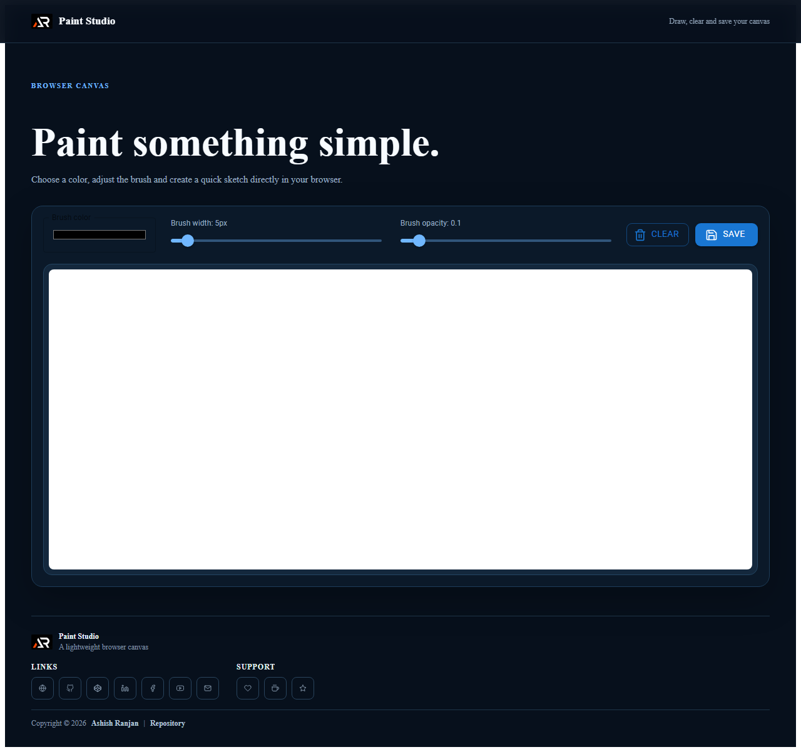

# Paint Studio

A lightweight React canvas app for drawing quick sketches, adjusting brush settings, clearing the canvas and saving the result as a PNG image.



## Features

- Responsive browser canvas with mouse and touch pointer support
- Adjustable brush color, width and opacity
- Clear and save-as-PNG actions
- Fixed branded header, icon-only links/support footer and go-to-top control
- Simple responsive layout for desktop and mobile screens

## Tech stack

React, Create React App, Sass, MUI and React Icons.

## Run locally

```bash
npm install
npm start
```

## Deploy

```bash
npm run build
npm run deploy
```

Live site: [Paint Studio](https://a2rp.github.io/paint-web-application/)

## Links

- Portfolio: [https://www.ashishranjan.net/](https://www.ashishranjan.net/)
- GitHub: [https://github.com/a2rp](https://github.com/a2rp)
- CodePen: [https://codepen.io/ash1198](https://codepen.io/ash1198)
- LinkedIn: [https://www.linkedin.com/in/aashishranjan](https://www.linkedin.com/in/aashishranjan)
- Facebook: [https://www.facebook.com/theash.ashish/](https://www.facebook.com/theash.ashish/)
- YouTube: [https://www.youtube.com/@ashishranjan-ashz?sub_confirmation=1](https://www.youtube.com/@ashishranjan-ashz?sub_confirmation=1)
- Email: [mailto:ash.ranjan09@gmail.com](mailto:ash.ranjan09@gmail.com)

## Support

- Support: [https://a2rp-donation-page.netlify.app/](https://a2rp-donation-page.netlify.app/)
- Buy Me a Coffee: [https://buymeacoffee.com/a2rp](https://buymeacoffee.com/a2rp)
- Patreon: [https://patreon.com/a2rp](https://patreon.com/a2rp)